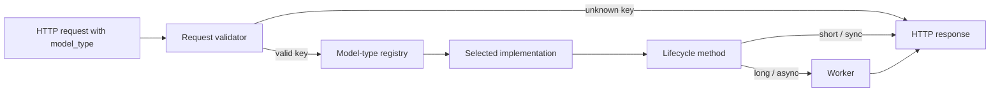
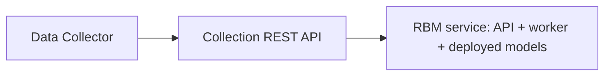
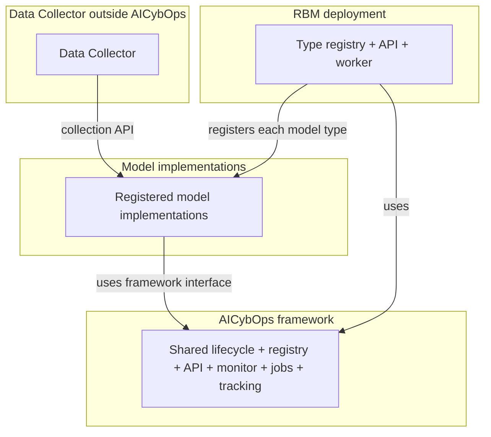
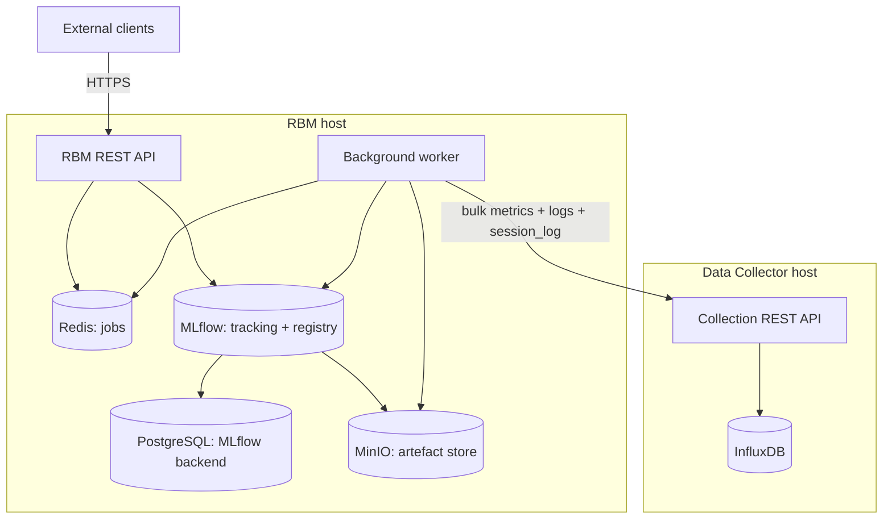
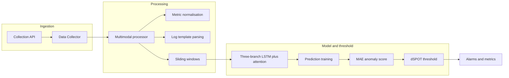
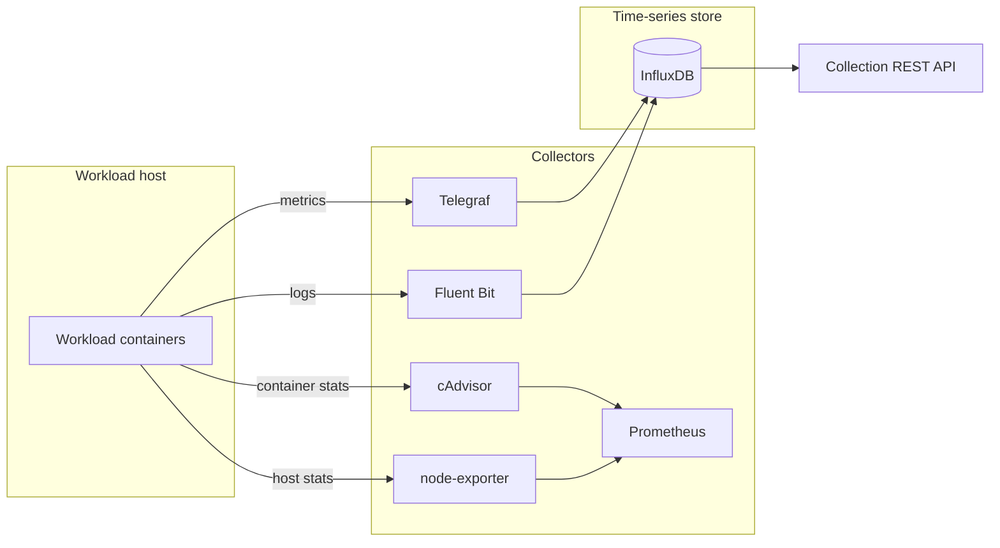

# AICybOps: A Framework for Operationalising Machine-Learning Models in Cybersecurity

**Final Report**

## Contents

1. [Introduction](#1-introduction)
2. [AICybOps Framework](#2-aicybops-framework)
3. [Integrated Platform Overview](#3-integrated-platform-overview)
4. [Deployment: Remote Behaviour Monitor](#4-deployment-remote-behaviour-monitor)
5. [Model Implementations](#5-model-implementations)
6. [Data Collection Infrastructure](#6-data-collection-infrastructure)
7. [End-to-End Validation](#7-end-to-end-validation)
8. [References](#8-references)

## 1. Introduction

This report describes **AICybOps**, a framework for operationalising machine-learning models as live, monitored services, and the platform built on it for microservice security monitoring. Deploying a model as a live service is as much an operational challenge as a modelling one: the model must run continuously, be updatable without downtime, and have every prediction attributable, reproducible, and auditable. AICybOps provides these at the framework level, so any model it hosts inherits them.

The report also covers its deployment as the **Remote Behaviour Monitor (RBM)**, the **Data Collector** that supplies microservice telemetry through a REST API, and the models it hosts: **DAM** (Deep Attentive anomaly detection with Multimodal data), a model developed in this project, and the **UC** (University of Coimbra) **model integrations**, which bring externally developed models onto the same service. The sections that follow cover the framework (Section 2), the integrated architecture (Section 3), the deployment (Section 4), the models (Section 5), the data collection infrastructure and its controlled Testbed (Section 6), and an end-to-end validation that runs the full model lifecycle (training, prediction, evaluation, and continuous monitoring) over one REST API (Section 7).

## 2. AICybOps Framework

This section describes the **AICybOps framework**, the central contribution of this project. AICybOps turns a model implementation into a deployed service: it serves the model's full lifecycle, from training through continuous monitoring, over a single REST API, and handles the operational concerns around a production model, such as long-running jobs, trained-model versioning, and experiment tracking. The Remote Behaviour Monitor (Section 4) is its deployed instance.

Every hosted model, DAM (Section 5.1) and the UC integrations (Section 5.2), plugs in through the **AICybOps model interface** (Section 2.2), the lifecycle each one implements. Around that interface the framework supplies the REST API, a model-type registry, durable asynchronous jobs, a continuous monitor loop, registry-versioned reload, and MLflow-backed tracking; its tracking server, registry, and object store stay private behind the service.

### 2.1 Design rationale, requirements, and positioning

For a hosted model, the framework provides everything operational around it, without the implementation writing any of it: the HTTP routes that expose its lifecycle, the background worker that runs long training and evaluation jobs, the logging of parameters and metrics, the versioning of trained artefacts, and the monitor loop. The implementation supplies only its lifecycle behaviour.

For the service, there is a single set of routes, a single dispatch path, and a single way of recording trained models, whatever the deployment hosts. Adding, replacing, or removing a model is a registration change at startup; the service never needs to know what an implementation does internally.

The two meet at the model interface. Because the service drives every model only through it, one service can host many models at once, and a model written to the interface runs on any AICybOps deployment without deployment-specific wiring (Section 2.3). Because the surrounding features live in the framework, a new framework-level capability reaches all hosted models at once.

**Operational requirements.** Deploying a machine-learning model as a live, operational service, particularly in a security context, imposes demands that go beyond the model itself: the service must run continuously, models must be updatable without downtime, long-running operations must be accessible over the network, and every model decision must be fully attributable and auditable.

Left to each model author to add separately, these properties end up inconsistent: fully implemented in some models, partially in others, and any gap is a risk. AICybOps instead provides them at the framework level, so every hosted model gets consistent tracking, versioning, and auditability while the developer writes only model logic. By design this includes how the model sources its data: the framework leaves data input unconstrained, to accommodate heterogeneous inputs. The five requirements below shape the features that follow.

1. **Continuous, in-service monitoring.** Beyond occasional one-off predictions, the service must run its own long-running prediction loop, with explicit start, stop, status, and recent-alarm controls. Addressed by the monitor lifecycle (Section 2.4).

2. **Updating the deployed model without redeploying the service.** When a re-trained version is registered, the operator must point the monitor at it without rebuilding the image, restarting, or editing service code. Addressed by stop-and-start on an explicit registered version, with reload from the registry (Section 2.4).

3. **Long-running training and evaluation over HTTP.** Training and held-out evaluation can take minutes to hours, so they must be triggered, polled, and inspected over the same REST API as prediction, without holding the connection open. Addressed by the asynchronous job lifecycle (Section 2.3).

4. **Tracing every prediction and alarm to a specific trained model.** Each result must be attributable to the exact model, inputs, parameters, and time that produced it, and that model must be reconstructable on another host. Addressed by MLflow-backed tracking (Section 2.5) with reload by registered name and version (Section 2.4).

5. **A model developer should implement only the model.** Implementing a model should mean defining its lifecycle (how it sources and prepares data, trains, predicts, and reports metrics) and nothing more. The operational features around it, serving over the API, the monitor loop, asynchronous jobs, versioning, and tracking, come from the framework. Addressed by the AICybOps model interface (Section 2.2), through which the framework supplies them (Sections 2.3–2.5).

Each requirement is met once, in the framework: implementing the model interface (Section 2.2) is enough for a model to inherit them all.

**Design principle and positioning.** The shared lifecycle is a small core, and additions follow one rule: a capability belongs in the framework only if most registered models need it and it reflects established practice in operational ML security. Everything there today qualifies. Experiment tracking, versioned registration, registry-based reload, asynchronous jobs, and continuous monitoring are operational requirements for any ML model in a security context, not choices specific to DAM; anything useful to only one model family stays in its implementation. This keeps the framework lean and auditable, and leaves room for further AI-security operations such as adversarial-robustness checks, explainability, and drift evaluation.

### 2.2 The AICybOps model interface

The AICybOps model interface is the lifecycle every hosted model implements. **Required** methods must be provided by every model; the framework calls them during training, prediction, and monitoring. **Optional** methods need not be overridden, and a request for an unsupported stage (for example held-out evaluation left at the default) returns a clear error rather than partial behaviour. The same REST API therefore serves every model, even when not all of them implement every stage.

The interface groups lifecycle methods as follows:

- **Data preparation:** `get_training_data`, `get_test_data`, `get_validation_data`, `get_prediction_data`. **Required:** every registered model must provide all four.
- **Construction:** `build_model`. **Required.**
- **Core lifecycle:** `train`, `test`, `validate`, `predict`. **Required.**
- **Combined orchestration:** `train_test_validate`. **Provided by the framework:** runs `train` → `test` → `validate` and registers MLflow versions on the test and validate stages.
- **Hyperparameter search:** `optimize`. **Optional, with a working default:** the framework ships a default search implementation that any model inherits unchanged; a subclass overrides it only to customise the search.
- **Held-out evaluation:** `evaluate`. **Optional:** the default implementation is unimplemented (it raises a not-supported error); models that support evaluation override it, and a request targeting a model that does not receives a clear error naming the unsupported stage.
- **Metadata for tracking:** `get_example_input`, `get_model_metrics`. **Required.** `get_example_input` supplies an example input from which the framework infers the model's **input signature** and records it alongside the trained artefact in the registry, so each registered version is self-describing: it can be reloaded and scored without a separate record of what it expects. `get_model_metrics` declares which metrics the model reports and how to rank them (used for tracking and model selection).

An implementation supplies the required methods and may override the optional ones; the framework provides the rest, including the combined orchestration. DAM (Section 5.1) and the UC integrations (Section 5.2) are worked examples.

### 2.3 Serving the lifecycle: registry, routes, and asynchronous jobs

**Model-type registry and request dispatch.** The framework holds an in-memory map from short string keys (the **model-type keys**) to the model implementations a deployment hosts. The service supplies the map at startup; the framework ships no fixed set of keys or models. A model-type key (for example `dam` here) is the public name a client uses to select a hosted model. Section 4.1 lists the keys registered for the RBM deployment.

Every train, predict, evaluate, and monitor-start request carries a `model_type` field. The framework looks it up in the registry, builds an instance from the request fields, and runs the requested lifecycle stage. All four entry points share this dispatch path; only the lifecycle method invoked at the end differs.

An unregistered `model_type` does not reach a model: train and evaluate fail request-schema validation (`422`), predict is rejected by the handler (`400`), and monitor start accepts the request but reports the unknown key through monitor status (Section 2.4) rather than failing the start call.



**Figure 1.** Request dispatch: the framework resolves `model_type` against the model-type registry, instantiates the chosen implementation, and either returns synchronously or hands long-running stages to the background worker. (The diagram shows the rejection path for train and evaluate; predict rejects in the handler with `400`, and monitor start defers the registry check to inside the loop; see Section 2.4.)

**HTTP routes.** The framework exposes one fixed set of HTTP routes, identical in request format, status codes, and job-polling across every deployment; what varies is only the registry contents and each implementation's lifecycle methods. The routes are:

- `POST /train/`: start a training job. The body selects the model type and carries its data-source configuration and hyperparameters. Returns a job identifier to poll (asynchronous by default).
- `POST /predict/`: score a bounded input window with an already-trained model. The body selects the model type and the registered name and version to reload; the response shape is the implementation's (for example scores, alarms, or per-window diagnostics).
- `POST /evaluate/`: run held-out evaluation of an already-trained model and record its quality metrics. Returns a job identifier to poll (asynchronous by default).
- `GET /jobs/{job_id}` and `GET /eval-jobs/{job_id}`: poll a training or evaluation job. The response returns the job's current status (`pending`, `running`, `completed`, `failed`) and, once the job completes, its full result payload.
- `POST /monitor/start`: start the continuous-monitoring loop for a registered model at a specified registered version. The body carries the experiment name, model type, name and version to reload, the polling interval, and any model-specific construction parameters.
- `GET /monitor/status`: report whether the monitoring loop is running, the time of its last successful scoring cycle, and any loop error since that tick.
- `GET /monitor/alarms`: return the most recent loop output and the timestamp of the last scoring cycle.
- `POST /monitor/stop`: stop the monitoring loop cleanly without restarting the service.
- `GET /`: a health check served by the framework.

A deployment's OpenAPI document lists the full set; Section 4.2 shows it enumerated live on the running service.

**Durable asynchronous jobs.** By default, training and evaluation run asynchronously: the framework returns a job identifier immediately and a background worker completes the job. A synchronous mode is available for short runs or scripted use.

| Mode            | HTTP                      | Behaviour                                                      |
| --------------- | ------------------------- | -------------------------------------------------------------- |
| Async (default) | `202 Accepted` + `job_id` | Job enqueued; poll `GET /jobs/{id}` or `GET /eval-jobs/{id}`   |
| Sync            | `?wait=true` → `200`      | Handler blocks until completion; same job handling internally  |

The framework generates the job identifier, a random UUID, and the `202 Accepted` response returns it with a ready-to-use status URL, so the client polls the exact path assigned rather than constructing one.

A job record carries the identifier, a status (`pending`, `running`, `completed`, `failed`), and, on completion, the result payload, which the polling endpoints return. The same job handling serves both modes: in synchronous mode the handler simply holds the connection while the worker runs the job.

**Architecture and composition.** The framework library is organised into five units, each with one responsibility: the **AICybOps model interface** (the lifecycle methods, Section 2.2); the **model-type registry** (keys to implementations); the **HTTP and job layer** (receives requests, dispatches them to the chosen implementation, and manages the async job queue and store); the **monitor component** (the continuous prediction loop and its status and alarm queries, Section 2.4); and the **tracking integration** (records every run in MLflow and registers the trained model, Section 2.5).

These share one interface, one registry, one job lifecycle, and one tracked record: the monitor loop, the async jobs, and one-off prediction all call the same lifecycle methods; predict, evaluate, and the monitor loop all use the same reload path; and every training request produces one tracked orchestration run, synchronous or async. The payoff is that **a new model implementation inherits all of this automatically**, bringing no serving code, monitor loop, or job wiring of its own.

### 2.4 Continuous monitoring and versioned reload

**Monitor lifecycle.** The framework runs a background prediction loop inside the service and keeps a small piece of state about it: whether the loop is running, the time of its last successful scoring cycle, the most recent loop output from that cycle, and the most recent loop error.

On `POST /monitor/start`, the framework returns immediately and runs the loop on a background thread. The start body names the experiment, model type, registered name and version, polling interval, and any model-specific construction parameters. On each interval the loop reloads the named version and scores fresh input through the same path as one-off predict (reload, below); in the RBM deployment that input is live data from the collection API. `GET /monitor/status` and `GET /monitor/alarms` report the running state, last-cycle time, latest output, and any loop error; `POST /monitor/stop` shuts the loop down cleanly without restarting the service. An unregistered `model_type` makes the loop exit at once, with status reporting `running` false and the invalid-key error (Section 2.3).

**Switching the monitored model to a newer trained version.** To move the monitor to a re-trained version (a new `dam` version registered after version 2), the operator stops the loop and starts a new one naming the new version; the framework reloads it through the same path and scoring continues, with no change to the service image or code and no restart. Pinning to an explicit version is recommended: every alarm is then attributable to a specific, identified trained model, and a mid-session training run never changes what is scoring without a deliberate switch (consistent with the lineage and audit-trail properties of Section 2.5). Started without a version, the loop reloads whichever is latest on each interval.

**One active monitor loop per service instance.** The framework runs at most one monitor loop per instance: a second `POST /monitor/start` returns `409 Monitor already running` rather than silently replacing the first, which keeps `/monitor/status` and `/monitor/alarms` unambiguous. To monitor several models at once, run several service instances behind the private network, each with its own status and alarm state; per-loop addressing within one instance is a natural later extension.

**Reload of a trained model by registered name and version.** "Reload" rebuilds an exact, ready-to-score copy of a trained model on the service host from its registry entry. When a `POST /predict/`, `POST /evaluate/`, or `POST /monitor/start` request names a version (for example `dam` at version 2), the framework locates that version's artefact in the registry, downloads the bytes from the object store, and reconstructs the model in memory, with everything inference needs: network weights, preprocessors and scalers, vocabularies, learned thresholds, and any other state the implementation saved. This same path is how every operation reaches an already-trained model: one-off predict, the monitor loop each interval, and evaluate.

Naming a version is optional: a pinned version always reloads exactly that model, while an unpinned name tracks the latest (like a dependency pin). Pinning is recommended where the auditability properties of Section 2.5 matter. Each implementation must register whatever its own methods will need at inference time; the framework restores whatever was registered.

### 2.5 Tracking, lineage, and AI-security properties

**MLflow tracking integration.** The framework records every training and evaluation run in MLflow without the implementation writing any MLflow code. Each lifecycle method it calls is wrapped so the call's parameters, metrics, model signature, and resulting trained artefact are logged into a tracked run automatically.

A single `POST /train/` produces one parent run, the **orchestration run**, with three nested children: `train`, `test`, and `validate`. Parameters are logged on `train`, metrics on the stages that return them, and signature inference and artefact registration on `test` and `validate` (and on `evaluate` where implemented). Section 7.4 shows the nested-run structure and registry versions from one such request on the cluster.

The advantage is that **every registered version is traceable end-to-end, with no separately kept records**. From a pointer like `dam` at version 2, an operator reaches the orchestration run that produced it, the parameters and metrics of each stage, the recorded model signature, and the artefact bytes themselves. This is the record an auditor or incident responder would otherwise rebuild from notes after the fact; here it falls out of the framework's normal call sequence, on every version, with no per-implementation tracking code.

Making tracking automatic rather than per-author is deliberate: hand-written tracking would vary by discipline, and one missing call or omitted metric would silently break a model's audit trail. At the framework level, every hosted model gets the same record, and a new model inherits full traceability with no tracking work of its own.

**AI-security properties.** The tracking record and the registry-versioned reload path together give the deployed service a set of AI-security properties. In a security-monitoring deployment the model is itself a security-critical asset (its outputs drive or inform response), so its decisions must be attributable, independently verifiable, and protected from undetected change. Each property below addresses one of those needs.

- **Lineage.** Every prediction, evaluation, and monitor run invokes the model by an explicit version, and training and evaluation are recorded under that version. So the model in service is always a known, identified artefact with a recorded origin, the precondition for holding its decisions accountable.
- **Portability and replay.** A name and version reconstruct the model on any host with registry access (a lookup, then `POST /predict/`). A security engineer can re-examine a past prediction, or run the model on new data, on another machine, without transferring or rebuilding it, so a detection is independently checkable rather than taken on trust.
- **Audit trail.** The versioned registry plus parameter and metric logging make the link from any deployed version back to the runs, parameters, and metrics that produced it explicit, so an external auditor can trace a version to its provenance without relying on operator testimony.
- **Per-stage reproducibility.** Each stage is a separate nested run rather than one opaque record, so if a metric or a version is later questioned, a review can isolate the exact stage that produced it instead of re-running or trusting the whole.
- **Private artefacts and tracking.** Because models are addressed through registry pointers rather than external URLs, the MLflow server, registry, and object store can stay private to the service host (Section 4.1), reachable only through the REST API, so artefacts and their provenance are not exposed externally.
- **One trusted source for trained-model identity.** Because reload is by registered name and version, the registry alone defines which trained model a name and version refer to, rather than URLs scattered across scripts, which removes the ambiguity that could let a model be silently substituted.

These properties are the foundation on which further AI-security-oriented operations can build.

## 3. Integrated Platform Overview

This section provides an overview of the integrated platform. **AICybOps** (Section 2) is the shared framework; **RBM** (Section 4) is the deployed ML service built on it, configured at startup to host the model implementations delivered in this project (Section 5). Telemetry flows through the **Data Collector** REST API (Section 6.2), with **Testbed**-backed conditions (Section 6.1).

### 3.1 End-to-end architecture

An overview of the data and control flow (from telemetry collection through model operations) is shown in Figure 2.



**Figure 2.** End-to-end platform view.

The Data Collector stores telemetry and serves it over the collection API. RBM orchestrates train, evaluate, predict, and monitor over one REST API, backed by asynchronous jobs, MLflow tracking, a model registry, and object store; the caller selects the model type and the service runs the operation on the matching implementation (Section 2.3).

RBM runs on a host separate from the collection API, consuming session context and telemetry across the cluster network (confirmed in Section 7.3). MLflow tracking, the model registry, and MinIO object store are **private dependencies** of RBM: external clients reach them only through the RBM REST API (Section 4), never directly.

### 3.2 AICybOps layer view

Figure 3 shows how the framework relates to hosted models, the RBM deployment, and the Data Collector that supplies their telemetry.



**Figure 3.** AICybOps framework, hosted models, RBM deployment, and the Data Collector.

Reading Figure 3 from the Data Collector outward: it serves metrics and logs through the collection REST API (Section 6.2) to the implementations that consume it (DAM in this deployment). Each registered implementation reaches the framework through the AICybOps model interface. RBM, in the deployment box, uses that same framework library for its REST API and worker and, at startup, loads this project's implementations into the registry under their model-type keys (Section 4.1).

## 4. Deployment: Remote Behaviour Monitor

This section describes the Remote Behaviour Monitor (RBM). RBM runs the AICybOps framework as a deployed ML service: a REST API and a background worker that load this deployment's model implementations at startup and run the framework routes against them.

### 4.1 Deployment topology

Figure 4 shows the RBM deployment topology.



**Figure 4.** RBM deployment topology: two hosts, private MLflow/MinIO/PostgreSQL/Redis on the RBM host, and outbound collection-API access from the worker.

The deployment places **RBM** and the **Data Collector** on separate hosts (Section 3). On the **RBM host**, the REST API is the only client-facing entry point: it accepts HTTPS, enqueues long-running work to **Redis**, and coordinates tracking and registry through **MLflow**. The **background worker** dequeues train and evaluate jobs, runs the model implementations, and writes metadata and versioned artefacts through MLflow into **PostgreSQL** (metadata) and **MinIO** (blobs). Redis, MLflow, PostgreSQL, and MinIO sit on the host's private network, not addressable by external callers.

On the **Data Collector host**, the **collection REST API** (Section 6.2) queries **InfluxDB** for bounded metrics and log windows and, where configured, serves Testbed session records. When a hosted model needs input (for example during training or evaluation on the worker), RBM calls that API across the cluster network; telemetry never flows through the RBM REST API, but is pulled from the collector on demand.

At startup, this project's RBM service configuration populates the framework registry with four model-type keys: `dam` (Section 5.1) and `nexus_xgb`, `nexus_ae`, and `modelos_uc2` (Section 5.2). Each is bound to a model implementation delivered in this project.

### 4.2 Service capabilities and configuration

The deployed service is the AICybOps framework with this project's implementations registered at startup. It exposes the framework's full set of routes (Section 2.3) on a single listener for all four model types, and reaches the collection API, MLflow server, registry, and object store of Section 4.1. Deployment-specific are only the registry contents (`dam`, `nexus_xgb`, `nexus_ae`, `modelos_uc2`) and the data-source configuration pointing DAM at the collection API.

The running service exposes documentation and all ten routes on one listener:

```text
GET /              -> 200
GET /docs          -> 200
GET /openapi.json  -> title=AICybOps API  version=1.0.0  paths=10
Routes: /train/, /evaluate/, /jobs/{job_id}, /eval-jobs/{job_id}, /predict/,
        /monitor/start, /monitor/status, /monitor/stop, /monitor/alarms
```

The end-to-end execution of the lifecycle against these routes (training, prediction, evaluation, and monitoring) is shown in Section 7.

### 4.3 Operational notes

**GPU readiness.** The service and DAM support GPU execution through configuration alone, with no application code changes: DAM reads the `DAM_DEVICE` environment variable in each lifecycle stage and moves computation to the chosen device, while the framework's REST API, job semantics, and tracking wiring are device-agnostic. The UC models (Section 5.2) run on CPU.

Switching to GPU is a configuration change: rebuild the service and worker images with `TORCH_VARIANT=cuda` for a CUDA-enabled PyTorch build, and update both containers' runtime configuration:

```yaml
# service and worker: GPU deployment
runtime: nvidia
environment:
  - DAM_DEVICE=cuda
  - AICYBOPS_TORCH_VARIANT=cuda
  - CUDA_VISIBLE_DEVICES=0   # remove the empty default that hides all devices
```

**Automation tooling.** A small set of scripts supports recurring operator tasks against the REST API validated in Section 7:

- **Per-model-type training scripts** drive `POST /train/`, poll the job to completion, and print a run summary with the registry pointer and telemetry volumes.
- **Live-prediction scripts** issue `POST /predict/` against a chosen registry version over a bounded live window.
- **Monitor-lifecycle script** runs the full `POST /monitor/start` → `GET /monitor/status` → `GET /monitor/alarms` → `POST /monitor/stop` sequence from one command.

## 5. Model Implementations

This section describes the model implementations deployed on the RBM service: the **DAM** model developed in this project (Section 5.1) and the **University of Coimbra (UC)** model integrations (Section 5.2), followed by what the two families share on the platform (Section 5.3). Each implements the AICybOps model interface (Section 2.2) and is reached through the same REST API.

### 5.1 DAM: multimodal anomaly-detection model

This subsection describes the DAM model (**Deep Attentive anomaly detection with Multimodal data**), developed in this project and deployed as model type `dam`. DAM is the multimodal anomaly-detection model shown operating end to end in Section 7. The parts below cover its design lineage, implementation and training pipeline, data ingestion, and integration with the AICybOps model interface.

#### 5.1.1 Foundational work

Chen, Y., Yan, M., Yang, D., Zhang, X., and Wang, Z. *Deep Attentive Anomaly Detection for Microservice Systems with Multimodal Time-Series Data.* Proc. IEEE ICWS 2022, pp. 373–378.

The ICWS 2022 paper motivates multimodal fusion, attentive temporal modelling over aligned time series, and dynamic thresholding for microservice anomalies. The implementation here follows that design direction and adapts it to the collection API and Testbed session records: collection API ingestion, three signal groups, LSTM (long short-term memory) encoders with attention, prediction-error scoring, and an extreme-value threshold.

| Reference stage (Chen et al.) | Implementation in this project                                                                        |
| ----------------------------- | ----------------------------------------------------------------------------------------------------- |
| Multimodal collection         | Collection API + optional Testbed session record for time bounds and labels                           |
| Fusion and alignment          | Metric normalisation, log template parsing, one-second alignment, overlap clipping                    |
| Attentive temporal model      | Three modality-specific recurrent encoders, scaled dot-product attention, per-modality prediction of next values |
| Dynamic threshold             | dSPOT (drift-aware SPOT) fitted on training prediction-error scores                                   |

#### 5.1.2 Implementation architecture

DAM is a self-contained registered implementation wired into the AICybOps framework (Section 2). It comprises an **orchestration layer** (configuration, lifecycle hooks, experiment logging, checkpoint and registry I/O), a **data path** (API or file ingest, windowing, labelling), a **neural model** (three-branch recurrent network with attention and prediction heads), and a **training and scoring pipeline** (optimisation, anomaly scores, threshold fitting).

The end-to-end internal pipeline is shown in Figure 5.



**Figure 5.** DAM end-to-end pipeline.

| Logical component    | Responsibility                                                                                        |
| -------------------- | ----------------------------------------------------------------------------------------------------- |
| Orchestration        | Train, test, validate, predict, evaluate; log runs; save and reload artefacts                         |
| Data Collector       | Login to collection API; session window; fetch metrics and logs; build label file from session record |
| Multimodal processor | Map raw signals to load / traffic / log groups; normalise; align; emit tensor windows                 |
| Neural model         | Encode each modality; attend over time; predict next values                                           |
| Pipeline             | Adam training with summed per-modality MSE; validation; score computation; SPOT/dSPOT baseline        |

#### 5.1.3 Neural model and training

**Input.** Each training or inference step uses three aligned sequences per window: load features, traffic features, and log-derived features (default window length **10** steps, stride **1**).

**Forward pass.**

1. **Per-modality recurrent encoders** (default hidden size **32**) produce temporal representations for load, traffic, and logs.
2. **Attention.** Final hidden states form a query; per-step encoder outputs are keys and values. **Scaled dot-product attention** combines the three modality streams into one representation for prediction.
3. **Prediction heads.** Three small fully connected stacks map the attended representation to each modality's next values (one head per group).

**Training.**

- Optimiser: **Adam**, default learning rate **1×10⁻⁴**.
- Loss: sum of three **mean-squared-error** prediction terms (one per modality), each comparing predicted next values to the actual next values.
- Optional **early stopping** on validation loss (configuration profile: patience 15, minimum improvement 0.02), which allows more epochs; the end-to-end run (Section 7) used a single epoch on a short training window to execute the pipeline (Section 5.1.6).
- After training: scores on the training set, then **dSPOT** baseline fit (default risk level **10⁻³**, depth **10**, initial quantile **0.95**).

**Scoring and alarms.**

- **Anomaly score:** mean absolute prediction error per window (the absolute error between predicted and actual values, one scalar per window).
- **Batch inference:** compare scores to the fitted threshold.
- **Stream inference:** scores fed through a drift-aware (dSPOT) threshold for the RBM monitor loop (Section 2.4).

**Persisted artefact** (registry / checkpoint) includes: network weights; inferred dimensions per modality; full configuration snapshot; thresholding state (SPOT type, risk, depth, training score vector); metric normalisation statistics for inference on new API windows. On reload, the threshold state is restored from stored training scores without re-fetching training telemetry.

#### 5.1.4 Data ingestion and processing

DAM uses the three signal groups summarised below; mappings are configurable per deployment (the table reflects the Robot Shop deployment).

| Group       | Typical container signals                     |
| ----------- | --------------------------------------------- |
| **Load**    | CPU usage, memory usage, block I/O read/write |
| **Traffic** | Network receive bytes                         |
| **Log**     | Parsed log templates (log-analyser format)    |

**Live ingestion.** As described in Section 6, the Data Collector authenticates to the collection API, optionally bounds the window with the Testbed session record, fetches metrics and logs for the configured interval, and, where a session record is present, derives per-window labels. Offline file-based ingestion is also supported.

**Processing.** The raw API rows are normalised, log entries are parsed into template vectors (Drain3), and the three signal groups are aligned to a common one-second timeline. The aligned series is clipped to the configured window and then split into fixed-length overlapping sequences ready for the model. The worker log captures the full chain:

```text
[DataCollector] Using session time range: start=-3021944s, stop=2026-04-15T11:34:58Z
[CallAPI] metrics status=200  rows=23663
[CallAPI] logs    status=200  format=loganalyzer
[DataCollector] Collected: 23663 metrics, 2465 logs
[DataCollector] Labels generated from session log -> /tmp/dam_collected/anomaly_labels.csv
[DAMDataProcessor] Processing metrics (load, align, normalize)
[DAMDataProcessor] Processing logs (aligned features)
[DAMDataProcessor] Clipping to first 5 min of overlap
[DAMDataProcessor] Aligned frames: metrics=(58, 5), logs=(127, 1)
[DAMDataProcessor] Sequences for 'load': shape=(49, 10, 4)
[DAMDataProcessor] Sequences for 'traffic': shape=(49, 10, 1)
[DAMDataProcessor] Sequences for 'log': shape=(49, 10, 1)
```

#### 5.1.5 DAM's implementation of the AICybOps model interface

DAM implements each lifecycle method in the AICybOps model interface (Section 2.2):

- **Data preparation hooks:** a Data Collector that authenticates to the collection API, bounds the window to the Testbed session interval (when available), fetches metrics and logs, and, where the session record is present, derives per-window labels.
- **`build_model`:** three-branch LSTM with scaled dot-product attention and three prediction heads (Section 5.1.3).
- **`train`:** Adam optimisation over summed per-modality MSE, optional early stopping; final pass over the training set to fit the dSPOT baseline.
- **`test`, `validate`:** loaders for the held-out splits; aggregated prediction error per window; metric dictionary returned to the framework's tracking integration.
- **`predict`:** reload weights, normalisation statistics, and threshold state from the registry pointer; score the requested window (batch or stream mode).
- **`evaluate`:** held-out window scoring with metric reporting; registers an additional version on the same model name.
- **Metadata** (`get_example_input`, `get_model_metrics`): example tensors at the configured window size and feature dimensions; metric dictionary used for tracking and registry signatures.

Request bodies pass DAM-specific settings (configuration profile, live API vs files, window size, threshold overrides) through the `data` and `model_params` fields the framework already exposes; no DAM-specific HTTP routes are added.

**Platform outcomes.** Section 7 documents the HTTP excerpts. On the same operability run:

- **Train:** async job completed; `dam` registered at versions 1 and 2 (test and validate stages); predict and monitor used version 2.
- **Predict:** `200`; reloaded `dam` version 2; 25 sequences scored.
- **Evaluate:** async job completed; 17 scored windows; registered `dam` version 3.
- **Monitor:** start, status, results, and stop on `dam` version 2; a second start returned `409`.

#### 5.1.6 Runtime illustration

The following worker lines show validation loss, dSPOT baseline fit, and validate-stage registry registration on completion of the train job (version 2; the test-stage registration of version 1 is in the full service log):

```text
Epoch 1/1, Average Train Loss: 56471.7422, Validation Loss: 14296.1387
[INFO] Anomaly detector baseline fitted using dSPOT.
Created version '2' of model 'dam'.
```

### 5.2 UC model integrations

The University of Coimbra (UC) delivered three model implementations, registered under their own model-type keys alongside `dam` (Section 4.1):

- **`nexus_xgb`:** supervised XGBoost classifier.
- **`nexus_ae`:** unsupervised autoencoder.
- **`modelos_uc2`:** a set of classical classifiers (decision tree, random forest, Gaussian and Complement Naive Bayes, SVM, one-class SVM, multilayer perceptron), each run on its own, exposed as one model type.

Each integration keeps UC's original scripts unchanged: a thin adapter implements the **AICybOps model interface** (Section 2.2) by calling the training and scoring steps UC already shipped. The three keys use the same routes as DAM (`POST /train/`, `POST /evaluate/`, `POST /predict/`) with the UC key in the body; there are no UC-specific HTTP routes.

**Lifecycle mapping.** The service calls the same lifecycle stages for every model type. For UC, the data-preparation stages do nothing, since each pipeline loads its own bundled datasets. Training and evaluation run the UC pipeline and return structured metrics in the job payload; prediction returns per-sample labels, or per-classifier diagnostics for the set of classical classifiers. The framework records runs in MLflow automatically; the adapters add no tracking of their own.

**Scope.** Section 7 covers `dam` end to end; the UC keys were validated separately with the standard train–predict–evaluate automation. The excerpts below show train, predict, and evaluate each completing through the same REST API for `nexus_xgb`, `nexus_ae`, and `modelos_uc2`, confirming wiring through the AICybOps model interface.

```text
POST /train/  model_type=nexus_xgb  -> 202 Accepted
GET  /jobs/...                      -> completed
  result keys: accuracy, f1_weighted, precision_weighted, recall_weighted, samples, anomalies_detected
  model_reference: null
POST /predict/  model_type=nexus_xgb  -> 200  (per-sample label list in response)
POST /evaluate/ model_type=nexus_xgb  -> 202; poll -> completed

POST /train/  model_type=nexus_ae   -> 202 Accepted  (same adapter pattern as nexus_xgb)
GET  /jobs/...                      -> completed
POST /predict/  model_type=nexus_ae   -> 200
POST /evaluate/ model_type=nexus_ae   -> 202; poll -> completed
```

```text
POST /train/  model_type=modelos_uc2  -> 202 Accepted
GET  /jobs/...                       -> completed
  result keys: models_run, models_with_accuracy, avg_accuracy
  model_reference: null
POST /predict/  model_type=modelos_uc2  -> 200  (per-classifier diagnostics)
POST /evaluate/ model_type=modelos_uc2 -> 202; poll -> completed
```

### 5.3 Cross-model observations

DAM and the three UC pipelines are developed independently and source their data differently: DAM pulls live telemetry from the collection API, while the UC pipelines load their own bundled datasets. Yet all four implement the same AICybOps model interface (Section 2.2), so one service reaches them through one REST API, one job lifecycle, one registry-reload path, and one MLflow tracking path, none bringing its own serving code, job wiring, monitor loop, or tracking. That a supervised classifier, an autoencoder, a set of classical classifiers, and a multimodal deep model coexist on one service through a single shared interface is the integration contribution of this project.

## 6. Data Collection Infrastructure

This section describes the data collection infrastructure that supplies telemetry to the model implementations (Section 5) and underpins the end-to-end validation (Section 7): the **Testbed** (Section 6.1) that generates controlled workload and labelled fault conditions, and the **Data Collector** (Section 6.2) that collects and serves telemetry through a collection REST API.

### 6.1 Testbed

This subsection describes the Testbed, which supplies realistic workload and fault conditions for running the ML service, and DAM in particular, end to end. The Testbed runs a controlled microservice workload with fault injection and records when disturbances occurred; it serves that record through the collection REST API, so DAM can pull metrics, logs, and session timing when training and scoring.

The workload is **Stan's Robot Shop** ([instana/robot-shop](https://github.com/instana/robot-shop)), a container-orchestrated sample e-commerce stack of application-tier microservices and backing data services, under steady load-generator traffic on its HTTP entry point. A single entry point deploys the stack, waits for readiness, runs traffic and fault injection together, and finalises the session record on shutdown. In the integrated deployment, one long-running session accumulated **12 837** fault events over a multi-week window (the precise interval is in the session-record excerpt below), with the ML service consuming Testbed timing and telemetry through the collection API on a separate host.

#### 6.1.1 Fault injection

A background loop runs through each session: after a variable **quiet interval** it picks a fault type from a **weighted registry**, chooses a target, samples duration and parameters, applies the disturbance, and appends an event to the session record. Seven fault types cover **resource contention** (CPU, memory, disk I/O in a chosen container), **network impairment** (egress delay, correlated loss, corruption), and **burst traffic** (extra load generators flooding the shop entry point for the event); lengths are drawn from configured ranges (typically tens of seconds, bounded upper tail). Targets are usually application-tier services, with datastore containers eligible for a subset of resource and delay faults, and a low **cascade** probability can add a related secondary fault within the window. Injection starts only after the containers and storefront health check pass.

#### 6.1.2 Session record and ground truth

The session record holds the session interval, each injected event (type, target, start, end, parameters), and derived **normal** intervals between fault windows. The Testbed writes the record locally and publishes it through the collection REST API (`GET /session_log`) during the run. Because the Testbed controls fault injection, models can align metrics and logs with known anomaly windows when training or evaluating (Section 5.1).

Example excerpt from the session-record JSON returned by `GET /session_log`:

```json
{
  "session_start": "2026-04-15T11:27:58.656Z",
  "session_end": "2026-05-20T10:51:33.720Z",
  "mode": "fault_injection",
  "total_faults": 12837,
  "fault_events": [
    {
      "event_id": "fault-0001-f29049",
      "fault_type": "disk_io_stress",
      "target_service": "robot-shop-rabbitmq-1",
      "start_ts": "2026-04-15T11:32:13.365Z",
      "end_ts": "2026-04-15T11:33:17.602Z",
      "duration_s": 63,
      "params": { "hdd_bytes_mb": 343, "hdd_workers": 3 },
      "label": "anomaly"
    }
  ]
}
```

A long-running session illustrated the coupling: all seven fault types were observed, fault durations stayed within configured bounds, and DAM training consumed the session record to label telemetry fetched via the collection API.

```text
Total fault events: 12837    Total normal intervals: 12838
Enabled fault types (all seven observed): cpu_contention, memory_contention, network_delay,
  network_loss, network_corruption, burst_traffic, disk_io_stress
Fault duration (seconds): count=12837  min=30.0  median=48.0  max=180.0
Labels generated from session record for training
```

The breakdown by fault type confirms that no declared type was missing from the long session:

```text
Fault count by type (session total = 12 837):
  network_delay        2367
  cpu_contention       2340
  disk_io_stress       1826
  memory_contention    1779
  network_loss         1674
  burst_traffic        1654
  network_corruption   1197
```

Targets concentrate on the application tier, with a smaller share on datastore containers (consistent with the safety guards in Section 6.1.1):

```text
Top target services (fault events):
  robot-shop-user-1       1819
  robot-shop-payment-1    1810
  robot-shop-cart-1       1802
  robot-shop-ratings-1    1781
```

### 6.2 Data Collector

This subsection describes the Data Collector, which collects and serves telemetry to the ML service: metrics and logs, plus Testbed session records where configured, through a collection REST API. Models request bounded time windows rather than relying on manually exported files.

#### 6.2.1 Time-series store and collectors

The Data Collector's back end is **InfluxDB**, fed continuously from the host running the microservice stack. **Telegraf** writes container and host metrics on a fixed interval, and **Fluent Bit** writes parsed container log lines into the same database; both run while the stack is up. The **collection REST API** (Section 6.2.2) serves time-bounded metrics and log windows for a requested `start`/`stop` interval by querying InfluxDB on demand.

The wiring between the workload, the collectors, the store, and the collection API is shown in Figure 6.



**Figure 6.** Data Collector pipeline: Telegraf metrics and Fluent Bit logs feed into InfluxDB and are served through the collection REST API on demand; Prometheus scrapes cAdvisor and node-exporter for container and host observability.

**Workload telemetry collection.** Because Telegraf's metrics and Fluent Bit's parsed logs share one time axis in **InfluxDB**, metrics and logs align for any requested `start`/`stop` window. In parallel, **Prometheus** scrapes **cAdvisor** and **node-exporter** for complementary container and host observability.

**Log-pipeline confirmation.** The block below confirms the log path end to end (Fluent Bit → InfluxDB → `GET /collect_logs/all_logs`), returning structured, parsed log lines across the workload's containers:

```text
Pipeline: Docker containers -> Fluent Bit -> InfluxDB (Second_Logs)
          -> collect_metrics_api GET /collect_logs/all_logs?format=loganalyzer
Query window:   start=-24h  stop=now
Distinct log sources (Robot Shop containers): 7
  robot-shop-ratings-1, robot-shop-web-1, robot-shop-catalogue-1, robot-shop-user-1,
  robot-shop-cart-1, robot-shop-payment-1, robot-shop-mongodb-1
Log timestamp span in export: ~24 hours
```

**Session record.** Authenticated `GET /session_log` serves the session metadata of Section 6.1.2 (interval, fault events, derived normal windows) alongside bulk telemetry. It is used when training or evaluating DAM on Testbed-controlled sessions, where fault timing is available for label generation, and is not part of the normal prediction or monitoring path.

#### 6.2.2 Collection REST API

The collection API is a REST API in front of the time-series store. The routes the platform uses are:

- health checks (`GET /test_connection`, unauthenticated);
- authenticated bulk metrics and logs (`GET /collect_metrics/all_container_metrics`, `GET /collect_logs/all_logs`);
- authenticated Testbed session records (`GET /session_log`).

Bearer-token authentication (tokens issued via `POST /login`) is enforced on the bulk telemetry and session-record retrieval routes listed above. Using explicit `start`/`stop` windows aligned to the session timeline restricts collection to the intended interval.

The excerpt below checks those routes and protections: collection-API health, authentication, and telemetry availability:

```text
GET /test_connection -> 200  status=ok  influxdb=connected
GET  /session_log (no token)     -> 401  Missing Authorization Header
POST /login (valid credentials)  -> 200  (token issued)
GET  /session_log (with token)   -> 200  (session record returned)
Collection API (session interval 2026-04-15 – 2026-05-20):
  upstream store: connected
  metrics availability in window: yes
  logs availability in window:    yes
```

A DAM data-collection request fetches metrics and logs for the bounded window from the bulk routes:

```text
[CallAPI] metrics status=200  rows=23663
[CallAPI] logs    status=200  format=loganalyzer
[DataCollector] Collected: 23663 metrics, 2465 logs
```

## 7. End-to-End Validation

This section provides the end-to-end validation of the platform: the integrated system running the full model lifecycle (train, predict, evaluate, monitor) against model type `dam`, on the deployment of Section 4 with the data collection of Section 6. The run follows a fixed sequence: the service is confirmed up with all routes reachable (Section 4.2); training registers a `dam` version; that version is reloaded for a live prediction; held-out evaluation runs through the async job path; and the monitor loop is started, queried, and stopped. Input validation and job-record persistence are confirmed throughout; the UC keys are covered in Section 5.2.

The excerpts are drawn from the run's service and worker logs; the training and evaluation job identifiers recur across the worker log, the service access log, and the job-record re-query, confirming a single run. The platform is a running service: an evaluator can issue the same requests and get the same response structure.

**Scope.** This section shows platform operability: the service accepts each request, runs every lifecycle stage end to end, and returns correct structured outputs. The bounded telemetry window drives the complete request-to-registry pipeline (collection-API fetch, async training job, registry versioning, reload, prediction, evaluation, and monitoring) identically to a full-scale campaign. Model-quality evaluation over a large campaign is a distinct, next-phase activity.

### 7.1 Training and evaluation runs

**Training.** `POST /train/` is issued for `dam`, drawing its data from the collection API over a short bounded window (`use_api=true`, session-bounded interval, five-minute slice). It is accepted with `202 Accepted` and a job identifier; the client polls until `completed`, and the result payload confirms registration:

```text
POST /train/  model_type=dam  use_api=true  training_window_minutes=5  -> 202 Accepted
              job_id=d5dc814c-3d5c-4812-a826-60b55f4bfa84
GET  /jobs/d5dc814c-3d5c-4812-a826-60b55f4bfa84 -> 200  status=running
... (29 `GET /jobs/...` polls at ~5 s cadence) ...
GET  /jobs/d5dc814c-3d5c-4812-a826-60b55f4bfa84 -> 200  status=completed
       registry: name=dam  version=2
       telemetry: metrics=23663  logs=2465
       train_loss=56471.74  val_loss=14296.14
```

The telemetry counts (23 663 metrics, 2 465 logs) match the worker log in Section 5.1.4, confirming the worker fetched live data from the collection API during training. The MLflow run structure and registry versions produced by this request are shown in Section 7.4.

**Evaluation.** `POST /evaluate/` runs held-out evaluation of `dam` at version 2 (on a live window independent of the training slice, `start=-180s`) through the same async job path as training:

```text
POST /evaluate/  model_type=dam  registered_model_name=dam  model_version=2  -> 202
              job_id=6c5d6d1d-0473-4139-beae-4bab0c9a1c81
GET  /eval-jobs/6c5d6d1d-0473-4139-beae-4bab0c9a1c81 -> completed (13 polls, ~66 s)
   anomaly_scores length=17  thresholds length=17  num_samples=17
   sample: anomaly_scores[0]=10.10  thresholds[0]=16.86
```

Seventeen scored windows and corresponding thresholds are returned in the completed job payload; the sample line confirms numeric score content, not empty placeholders.

**Job-record persistence.** Completed jobs remained retrievable by the same identifiers after intervening activity, approximately 5.5 minutes after training completed and 2 minutes after evaluation:

```text
GET /jobs/d5dc814c-3d5c-4812-a826-60b55f4bfa84 -> 200  status=completed  has_result_payload=True
    registered_model_name=dam  model_version=2
    data_collection_metrics_count=23663  data_collection_logs_count=2465
    train_loss=56471.74  val_loss=14296.14
GET /eval-jobs/6c5d6d1d-0473-4139-beae-4bab0c9a1c81 -> 200  status=completed  has_result_payload=True
    anomaly_scores length=17  thresholds length=17  num_samples=17
    metrics keys returned: accuracy, precision, recall, f1_score, ...
```

The telemetry counts (23 663 / 2 465) match those in the original training job response, confirming the result payload is stored durably.

### 7.2 Prediction and monitoring

**Prediction.** With `dam` at version 2 registered, `POST /predict/` reloads that version from the registry, fetches a live 180-second window from the collection API, and returns a structured result, demonstrating the full chain from registry reload through live data ingestion to model output:

```text
POST /predict/  -> 200
   registered_model_name=dam  model_version=2
   live collection API window: last 180 seconds
   prediction_diagnostics: num_sequences=25  num_alarms=0
```

Twenty-five sequences were scored against the reloaded version 2 threshold. No alarms were raised on this short live window, the expected result for normal-condition telemetry outside a fault-injection interval.

**Continuous monitoring.** The monitor loop is started against `dam` version 2, polling live telemetry every 60 seconds. Start, status, alarms, and stop each complete:

```text
POST /monitor/start  model_type=dam  registered_model_name=dam  model_version=2
                     interval_seconds=60  -> 200  status=started
GET  /monitor/status -> 200  running=true  last_alarm_at=null
GET  /monitor/alarms -> 200  alarms=null  last_alarm_at=null
POST /monitor/stop   -> 200  status=stopped
```

On each interval the loop (a background thread in the RBM process) scores live telemetry against the pinned `dam` version 2, the same predict path as above; clients only start, poll, and stop it. `alarms=null` on this short run matches the predict result. A second `POST /monitor/start` returns `409 Monitor already running`, confirming the single-loop guard of Section 2.4:

```text
POST /monitor/start (first)  -> 200
POST /monitor/start (second) -> 409  Monitor already running
```

**Input validation.** The service validates input across all entry points: unknown job IDs, unknown model types, and missing required fields are each rejected with the appropriate status, while the known training job identifier still returns its full result:

```text
GET /jobs/d5dc814c-3d5c-4812-a826-60b55f4bfa84             -> 200  status=completed   (train job from above)
GET /jobs/bogus-job-id-0000-0000-0000-000000000000          -> 404  Job not found
GET /eval-jobs/bogus-eval-job-id-0000-0000-0000-000000000000 -> 404  Evaluation job not found
POST /train/  model_type=this_model_type_does_not_exist     -> 422  Invalid model type: this_model_type_does_not_exist
POST /evaluate/  body={model_type: dam} only
               (experiment_name and evaluation_config omitted) -> 422  Field required (experiment_name, evaluation_config)
POST /predict/  model_type=dam
                registered_model_name=this_model_does_not_exist_in_registry  model_version=999999
                                                              -> 500  No model available for prediction
```

The invalid-model-type `422` confirms only the four startup keys (`dam`, `nexus_xgb`, `nexus_ae`, `modelos_uc2`) are accepted; train and evaluate reject unregistered keys before any model logic. For predict, an unregistered model type is rejected with `400`, while a valid type with a non-existent registry name returns `500` (as shown); monitor start reports an unknown type through status rather than failing (Section 2.3).

### 7.3 Cross-host integration

The integrated deployment runs the RBM service and the collection API on separate hosts (Section 4.1). A cross-host probe resolved two externally addressable components on distinct hostnames and IP addresses:

```text
RBM service             hostname=host-A        ip=<redacted>     port=443 (default HTTPS)
Collection API          hostname=host-B     ip=<redacted>     port=5010
distinct hostnames: 2   distinct IPs: 2
```

The training run confirms data flow across that boundary: the worker on the RBM host fetched 23 663 metrics and 2 465 logs from the collection API on the Data Collector host (Sections 5.1.4, 7.1), and those counts reappear in the persisted job payload. Telemetry crosses the network only on demand, pulled by the worker, never through the RBM REST API.

### 7.4 Tracking and lineage

The training request produced the nested MLflow run structure described in Section 2.5 (one orchestration run with `train`, `test`, and `validate` children) and registered two `dam` versions on completion: version 1 on the test stage and version 2 on the validate stage. The service log confirms the registry and artefact activity:

```text
Successfully registered model 'dam'.
Created version '1' of model 'dam'.   # train job, test stage
Created version '2' of model 'dam'.   # train job, validate stage
Downloading artifacts: 100%|██████████| 6/6
```

Version 2 (validate stage) is the known-provenance version used for predict and monitor; version 1 (test stage) remains as a record. The evaluate path (Section 7.1) registered version 3: each evaluation run is a separate registry entry by design, keeping evaluation metrics distinct from the training run's provenance. The `dam` registry therefore holds three versions, each reachable from its name-and-version pointer back to the run, parameters, and metrics that produced it.

### 7.5 Requirements coverage

Each of the five operational requirements from Section 2.1 is demonstrated by the run above:

| Requirement (Section 2.1) | Demonstrated by |
| ------------------------- | --------------- |
| 1. Continuous, in-service monitoring | Monitor start/status/alarms/stop and the single-loop `409` guard (Section 7.2) |
| 2. Updating the deployed model without redeploying | Predict and monitor reload a pinned registered version (`dam` v2) from the registry; new versions registered without touching the service image (Sections 7.2, 7.4) |
| 3. Long-running training and evaluation over HTTP | `202`-plus-poll asynchronous train and evaluate jobs, retrievable after completion (Section 7.1) |
| 4. Tracing every prediction and alarm to a specific trained model | Predict and monitor invoke `dam` by explicit version; nested-run tracking and three registry versions tie each result to its provenance (Sections 7.2, 7.4) |
| 5. A model developer implements only the model | DAM and the UC models reach the same routes, jobs, monitor, and tracking through the interface alone, with no per-model serving code (Sections 5, 7) |

## 8. References

### 8.1 External publication

Chen, Y., Yan, M., Yang, D., Zhang, X., and Wang, Z. *Deep Attentive Anomaly Detection for Microservice Systems with Multimodal Time-Series Data.* In *Proc. IEEE International Conference on Web Services (ICWS 2022)*, Barcelona, Spain, July 10–16, 2022, pp. 373–378.

### 8.2 Testbed workload

Instana. *robot-shop* (Stan's Robot Shop). GitHub: [https://github.com/instana/robot-shop](https://github.com/instana/robot-shop). Apache-2.0 license.

*End of report.*
